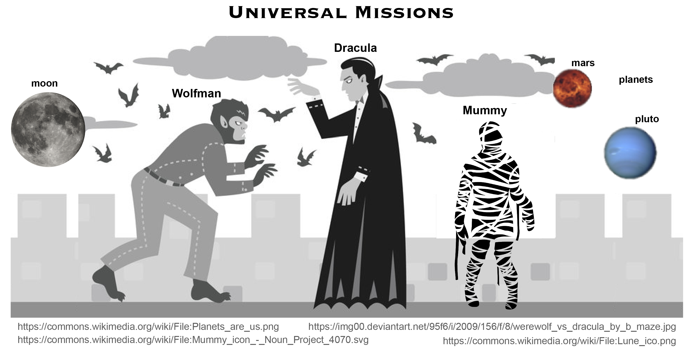

# 저장소 생성 {#git-create}


Git 환경설정이 완료되면, Git를 사용할 수 있다. 
행성 착륙선을 화성에 보낼 수 있는지 조사를 하고 있는 늑대인간과 드라큘라 이야기를 계속해서 진행해 보자.



먼저 바탕화면(`Desktop`)에 작업할 디렉토리를 생성하고, 생성한 디렉토리로 이동하자:

```
$ cd ~/Desktop
$ mkdir planets
$ cd planets
```

그리고 나서, `planets`을 **저장소(repository)**로 만든다 &mdash; 
저장소는 Git이 파일에 대한 버젼정보를 저장하는 장소다:

```
$ git init
```


`git init` 명령어가 서브디렉토리(subdirectory)와 파일을 담고 있는 저장소를 생성하는데 주목한다 ---
`planets` 저장소 내부에 중첩된 별도 저장소를 생성할 필요는 없다.
또한, `planets` 디렉토리를 생성하고 저장소로 초기화하는 것은 완전히 서로 다른 과정이다.

`ls`를 사용해서 디렉토리 내용을 살펴보면, 변한 것이 아무것도 없는 것처럼 보인다:

```
$ ls
```


하지만, 모든 것을 보여주는 `-a` 플래그를 추가하면, 
Git은 `planets` 디렉토리 내부에 `.git` 로 불리는 숨겨진 디렉토리를 생성한 것을 볼 수 있다:


```
$ ls -a

.	..	.git
```

Git은 `.git`이라는 특별한 하위 디렉토리에 프로젝트에 대한 정보를 저장한다. 
여기에는 프로젝트 디렉토리 내부에 위치한 모든 파일과 서브 디렉토리가 포함된다.
만약 `.git`를 삭제하면, 프로젝트 이력을 모두 잃어버리게 된다.

모든 것이 제대로 설정되었는지를 확인을 하려면,
Git에게 다음과 같이 프로젝트 상태를 확인 명령어를 던진다:


```
$ git status

# On branch master
#
# Initial commit
#
nothing to commit (create/copy files and use "git add" to track)
```


다른 `git` 버전을 사용할 경우, 출력 결과물이 다소 다를 수도 있다.

::: {#git-repository .rmdcaution}

**Git 저장소를 생성할 장소**

(이미 생성한 프로젝트) 행성에 대한 정보를 추적하면서,
드라큘라는 달에 관한 정보도 추적하고자 한다.
`plantes` 프로젝트와 관련된, 새로운 프로젝트 `moons` 를 시작한다.
늑대인간의 걱정에 불구하고, Git 저장소 내부에 또다른 Git 저장소를 생성하려고 
다음 순서로 명령어를 입력해 나간다:

```
$ cd ~/Desktop   # 바탕화면 디렉토리로 되돌아 간다.
$ cd planets     # planets 디렉토리로 들어간다.
$ ls -a          # planets 디렉토리에 .git 서브 디렉토리가 있는지 확인한다.
$ mkdir moons    # planets/moons 서브 디렉토릴르 생성한다.
$ cd moons       # moons 서브 디렉토리로 이동한다.
$ git init       # Git 저장소를 moons 하위디렉토리에 생성한다.
$ ls -a          # 새로운 Git 저장소가 .git 하위 디렉토리에 있는지 확인한다.
```

`moons` 서브 디렉토리에 저장된 파일을 추적하기 위해
`moons` 디렉토리 안에서 `git init` 명령을 실행해야 할까?

> **해답**
>
> 아니다. `moons` 서브 디렉토리에 Git 저장소를 만들 필요는 없다.
> 왜냐하면, `planets` 저장소가 이미 모든 파일, 서브 디렉토리, `planets` 디렉토리
> 아래 서브 디렉토리 파일 모두를 추적하기 때문이다.
> 따라서, 달에 관한 모든 정보를 추정하는데, 드랴큘라는 `planets` 디렉토리 아래
> `moons` 서브 디렉토리를 추가하는 것으로 충분하다.
> 
> 추가적으로, 만약 Git 저장소가 중첩(nested)되면, Git 저장소는 서로 방해할 수 있다:
> 바깥 저장소가 내부 저장소 버전관리를 하게 된다.
> 따라서, 별도 디렉토리에 서로 다른 신규 Git 저장소를 생성하는게 최선이다.
> 
> 디렉토리에 저장소가 서로 충돌하지 않도록 하려면, `git status` 출력물을 점검하면 된다.
> 만약, 다음과 같은 출력물이 생성되게 되면 신규 저장소를 생성하는 것이 권장된다:
>
> ```
> $ git status
> 
> fatal: Not a git repository (or any of the parent directories): .git
> ```

:::

::: {#git-init .rmdcaution}

**`git init` 실수 올바르게 고치기**

늑대인간은 드라큘라에게 중첩된 저장소가 중복되어 불필요한 이유와 함께 향후 혼란을 야기할 수 있는 
이유를 설명했다. 드라큘라는 중첩된 저장소를 제거하고자 한다. 
`moons` 서브 디렉토리에 마지막으로 날린 `git init` 명령어 실행취소를 어떻게 할 수 있을까?

> **해답 -- 주의해서 사용바람!**
>
> 이러한 사소한 실수를 원복하고자, 드라큘라는 `planets` 디렉토리에서 다음 명령어를 실행하여 
> `.git` 디렉토리를 제거하기만 하면 된다:
>
> ```
> $ rm -rf moons/.git
> ```
>
> 하지만, 주의한다! 디렉토리를 잘못 타이핑하게 되면, 보관해야하는 프로젝트 정보를 담고 있는 
> Git 이력 전체가 날아가게 된다. 따라서,  `pwd` 명령어를 사용해서 현재 작업 디렉토리를 항상 확인한다.

:::
