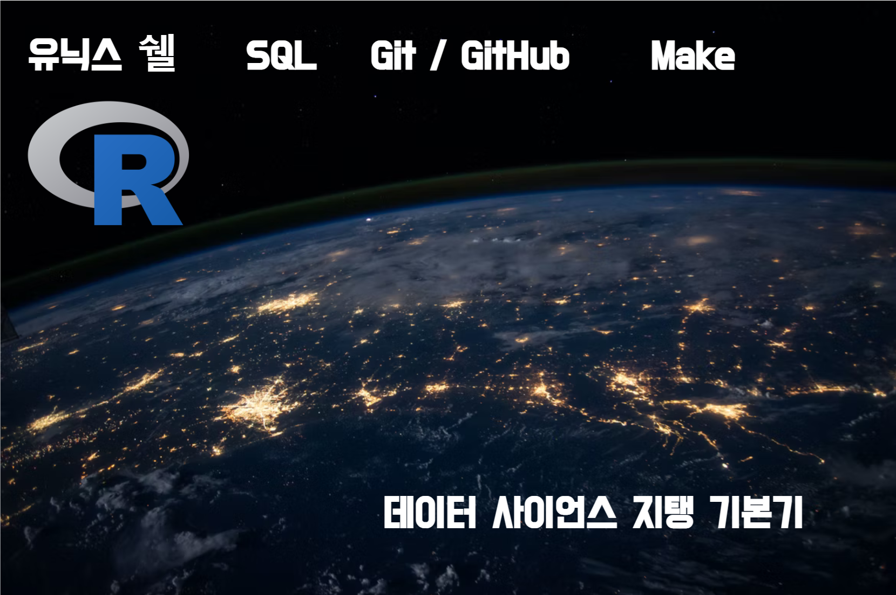

--- 
title: "데이터 과학을 지탱하는 기본기"
author: "한국 알 사용자회"
date: "2022-05-14"
site: bookdown::bookdown_site
output: bookdown::gitbook
documentclass: book
bibliography: [book.bib, packages.bib]
biblio-style: apalike
link-citations: yes
github-repo: bit2r/book_analytics
description: "데이터 과학을 지탱하는 기본기를 정리하여 공개합니다."
---

# 데이터 과학을 지탱하는 기본기 {-#swc-intro}

데이터 사이언스는 단일 도구나 언어로 구성되어 있지 않습니다.
데이터 사이언스는 유닉스 쉘, Git/GitHub, Make, SQL, R 프로그래밍 언어로 팀을 
꾸려 급격히 진행되는 디지털 전환(Digital Transformation) 시대 불평등 해소와 
디지털 경제 성장에 큰 기여를 하고 있습니다.

도구나 언어적인 측면에서 보면 운영체제 리눅스를 근간으로 하는 **유닉스 쉘**이 자동화를 
담당하는 것을 시작으로 빅데이터를 가공하고 가치를 높일 수 있는 형태의 정형 데이터를 
책임지는 **SQL**, 시간여행을 책임지는 **Git**, 협업과 공유를 담당하는 **GitHub**, 
작업흐름을 담당하는 **Make** 그리고 기계와 대화를 담당하고 추상화 역할을 수행하는 
**프로그래밍 언어 R**이 각자 역할을 하면서 데이터 사이언스 생태계를 구성하게 됩니다.

{width=100%}

---

사단법인 한국 알(R) 사용자회는 디지털 불평등 해소와 통계 대중화를 위해 
2022년 설립되었습니다. 오픈 통계 패키지 개발을 비롯하여
최근에 데이터 사이언스 관련 교재도 함께 제작하여 발간하는 작업을 수행하고 있습니다.
그 첫번째 결과물로 John Fox 교수님이 개발한 설치형 오픈 통계 패키지 `Rcmdr`[@fox2016using] [@rcmdr2022manual] [@rcmdr2005paper] 를 신종화 님께서 한글화 및 문서화에 10년 넘게 기여해주신 한국알사용자회 저작권을 흔쾌히 
허락해 주셔서 [설치형 오픈 통계 패키지 - `Rcmdr`](https://r2bit.com/Rcmdr/)로 세상에 나왔습니다.

두번째 활동을 여기저기 산재되어 있던 시각화 관련 자료를 묶어
**[데이터 시각화(Data Visualization)](https://r2bit.com/book_viz/)**를 전자책 형태로 공개하였고,
데이터 분석 관련 저술을 이어 진행하게 되었습니다.

데이터 분석 언어 R에 관한 지식을 신속히 습득하여 독자들이 갖고 있는 문제에 
접목시키고자 하시는 분은 한국 알(R) 사용자회에서 번역하여 공개한 
[R 신병훈련소(Bootcamp)](https://dl-dashboard.shinyapps.io/rbootcamp/) 과정을
추천드립니다.

---

"데이터 과학을 지탱하는 기본기" 저작을 위해 소프트웨어/데이터 카펜트리(Software/Data Carpentry)의 
원작내용을 번역[@software-carpentry]하고 필요한 경우 한국에서 고급 데이터 분석작업을 수행하기 위해 
저자들의 경험을 녹여 제작한 출판물임을 밝혀둡니다.

"데이터 과학을 지탱하는 기본기" 저작물을 비롯한 한국 알(R) 사용자회 저작물은 
크리에이티브 커먼즈 [저작자표시-비영리-동일조건 변경 허락 (BY-NC-SA)](http://ccl.cckorea.org/about/)
라이선스를 준용하고 있습니다. 

  

관련 문의와 연락이 필요한 경우 한국 알(R) 사용자회 admin@r2bit.com 대표전자우편으로 연락주세요.

---

::: {#book-sponsor .rmdtip}
**후원계좌**

디지털 불평등 해소를 위해 제작중인 오픈 통계패키지 개발과 고품질 콘텐츠 제작에 큰 힘이 됩니다.

  - 하나은행 448-910057-06204
  - 사단법인 한국알사용자회
:::
