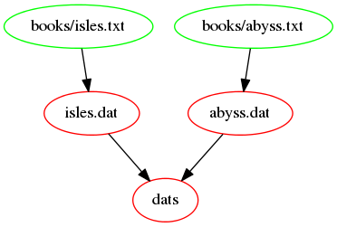

# Makefiles {#make-makefiles-chapter}

다음 내용을 갖는 `Makefile`로 불리는 파일을 생성한다:

```
# 단어 갯수를 센다.
isles.dat : books/isles.txt
        python wordcount.py books/isles.txt isles.dat
```

간단한 **빌드 파일**로,
Make를 사용할 때 **Makefile**로 불리우며 -
Make가 실행하는 파일이다. 순차적으로 각 라인을 찬찬히 살펴보자:

* `#` 은 *주석*을 나타낸다. `#` 시작되는 어떤 텍스트나 끝 줄까지 Make가 무시한다.
* `isles.dat` 는 **대상(target)**으로, 생성되거나 빌드되는 파일이다.
* `books/isles.txt` 파일은 **의존성(dependency)**으로,
  대상을 빌드하거나 갱신하는데 필요한 파일이 된다. 대상은 의존성을 0 혹은 여러개 갖을 수 있다.
* `:` 은 구분자로 대상과 의존성을 구별한다.
* `python countwords.py books/isles.txt isles.dat` 은 **동작(action)**으로, 의존성을 사용해서 대상을 빌드하거나 갱신하는데 실행되는 명령어가 된다. 대상은 의존성을 0 혹은 여러개 갖을 수 있다.
* 동작은 공백 8자가 *아니라,* 탭(TAB) 문자를 사용해서 들여쓰기 한다. 1970년부터
   사용된 Make 유산이다.
* 대상, 의존성, 동작이 모여 **규칙(rule)**을 구성하게 된다.

상기 규칙은 `python countwords.py` 동작과 `books/isles.txt` 의존성을 사용해서
`isles.dat` 대상을 빌드하는 방식을 기술하고 있다.

아무것도 없는 처음 상태에서 시작하도록, 생성했던 `.dat` 와 `.png` 확장자를 갖는 파일을 삭제한다:

```
$ rm *.dat *.png
```

기본 디폴트 설정으로, Make는 `Makefile`로 불리는 Makefile을 찾는다.
그리고, Make를 다음과 같이 실행한다.

```
$ make
```

Make는 실행하는 동작을 화면에 출력한다:

```
python countwords.py books/isles.txt isles.dat
```

만약 다음 메시지를 보게 되면,

```
Makefile:3: *** missing separator.  Stop.
```

동작 중 하나를 들여쓰는데 탭 문자 대신에 공백을 사용했기 때문이다.

기대한 결과가 나왔는지 확인해보자.

```
head -5 isles.dat
the 3822 6.737176097303014
of 2460 4.336329984135378
and 1723 3.0371937246606735
to 1479 2.607086197778953
a 1308 2.305658381808567
```

`isles.dat` 파일 첫 5행이 이전 실행결과와 정확하게 동일해야 된다.

::: {#make-evoke .rmdcaution}

Makefile을 `Makefile`로 호명할 필요는 없다. 하지만,
그밖의 다른 것으로 호명하려면, Make가 어디서 찾을 수 있는지 일러줄 필요가 있다.
`-f` 플래그를 사용해서 파일명을 지정할 수 있다. 예를 들어:

```
$ make -f MyOtherMakefile
```

:::

Makefile을 재실하면, Make가 다음과 같이 정보를 준다:

```
make: `isles.dat' is up to date.
```

상기와 같이 출력되는 이유는 대상 `isles.dat` 파일이 이제 생성되어서,
Make가 다시 생성하기 않기 때문이다.
작동 방식을 살펴보기 위해서, 텍스트 파일 중 하나를 갱신한 척 해보자.
편집기에서 파일을 여는 대신에, 쉘 `touch` 명령어를 사용해서 시간도장(timestamp)을 갱신한다.
시간도장 갱신은 파일을 편집하면 발생되게 된다:

```
$ touch books/isles.txt
```

`books/isles.txt` 파일과 `isles.dat` 파일 시간도장(timestamp)을 비교하면,

```
$ ls -l books/isles.txt isles.dat
```

대상 `isles.dat` 파일이 의존성 `books/isles.txt` 파일보다 더 이전 파일임을 알게 된다:

```
-rw-r--r--    1 mjj      Administ   323972 Jun 12 10:35 books/isles.txt
-rw-r--r--    1 mjj      Administ   182273 Jun 12 09:58 isles.dat
```

Make를 다시 실행하면,

```
$ make
```

`isles.dat` 파일을 다시 생성시킨다:

```
python countwords.py books/isles.txt isles.dat
```

대상을 빌드하도록 Make가 요청받을 때,
Make는 대상과 의존성 모두의 '최종 변경 시간'을 검사한다.
만약 대상과 비교해서 의존성에 갱신된 것이 있다면, 대상을 갱신하도록 동작을 다시 실행한다.
이러한 접근법을 사용해서 `Make`는 직간접적으로 변경된 파일만 다시 빌드작업을 수행한다.
이것을 **증분 빌드(incremental build)**라고 한다.

::: {#make-document .rmdcaution}

**문서로 `Makefiles`**

파일간 의존성과 함께 분석 단계 입력과 출력을 명시적으로 기록함으로써,
Makefiles은 일종의 문서(documentation)로 역할을 수행하여 작업자가 기억해야 되는 
것을 대폭줄여준다.
:::

`Makefile` 파일 후미에 또다른 규칙을 추가하자:

```
abyss.dat : books/abyss.txt
        python wordcount.py books/abyss.txt abyss.dat
```

`Make`를 실행하면,

```
$ make
```

다음 결과를 얻게 된다:

```
make: `isles.dat' is up to date.
```

아무일도 발생하지 않는데, 이유는 Make가 `Makefile`에서 찾게되는 첫번째 대상만
빌드하려고 하기 때문이다. 첫번째 대상이 **기본 디폴트 설정 대상(default target)**으로 
`isles.dat` 파일이 되는데 이미 최신 상태다.
명시적으로 Make에게 `abyss.dat` 파일을 빌드한다는 의도를 일러줄 필요가 있다:

```
$ make abyss.dat
```

이제 다음 결과를 얻게 된다:

```
python countwords.py books/abyss.txt abyss.dat
```

::: {#make-upto-date .rmdcaution}

**"Up to Date" vs "Nothing to be Done"**

`Make`가 이미 존재하고 가장 최신(up to date) 파일을 빌드하는 경우 
`Make`는 다음 사항을 알려준다.

```
make: `isles.dat' is up to date.
```

`Make`가 이미 존재하지만 `Makefile`에 규칙(rule)이 없는 경우는,
다음 메시지를 `Make`가 알려준다.

```
$ make countwords.py

make: Nothing to be done for `countwords.py'.
```

`up to date` 가 의미하는 바는 `Makefile`에 파일(혹은 디렉토리)과 
연관된 액션을 갖는 규칙이 있지만 파일이 가장 최신 상태임을 반증한다.
`Nothing to be done`은 파일이 존재는 하지만 다음 사항을 나타내고 있다.

- `Makefile`이 해당 규칙이 없다.
- `Makefile`이 규칙은 있으나 액션을 갖고 있지 않다.

:::


작업한 모든 파일을 제거하고 나서 명시적으로 전부 재생성할 수 있다.
이 작업으로 새로운 대상과 연관된 규칙 `clean`을 도입한다:
`.dat` 파일처럼 자동생성된 파일을 제거하는 일반적인 명칭이다.

```
clean : 
        rm -f *.dat
```

상기 규칙예제가 의존성을 갖지 않는 사례다.
`clean`은 어떤 `.dat` 파일에 대해서도 의존성이 없다. 왜냐하면,
금방 삭제될 파일을 다시 생성하는 것이 무의미하기 때문이다.
파일이 존재하든 존재하지 않던 데이터 파일을 제거하고자 한다.
대상을 명세하고 Make를 실행하면,

```
$ make clean
```

다음 결과를 얻게 된다:

```
rm -f *.dat
```

`clean`으로 실제로 어떤 것도 빌드되지는 않는다.
오히려, 유용한 연속 동작을 실행하는데 사용하는 약칭이 된다.
매우 유용하지만, 이런 대상이 문제를 불러 일으킬 수 있다.
예를 들어, 데이터 파일을 다시 생성하고, `clean` 이라는 디렉토리를 생성하고 나서,
Make를 실행한다:

```
$ make isles.dat abyss.dat
$ mkdir clean
$ make clean
```

다음 결과를 얻게 된다:

```
make: `clean' is up to date.
```

Make가 `clean`이라는 파일(혹은 디렉토리)을 찾는다.
`clean` 규칙에는 어떤 의존성도 없기 때문에, 
`clean` 이 빌드되어서 최신 상태라고 가정하게 된다.
그래서, 규칙에 나온 동작을 하나도 실행하지 않는다.
`clean`을 약칭으로 사용할 때, `make clean` 명령어를 실행하면,
항상 해당 규칙을 Make가 실행하도록 일러줄 필요가 있다.
Make에게 어떤 것도 빌드하지 않는 **가짜 대상(phony target)**이라고
일러줘서 이 문제를 해결한다. 대상을 `.PHONY`로 표식해서 해당 작업을 수행한다:

```
.PHONY : clean
clean : 
        rm -f *.dat
```

Make를 실행하면,

```
$ make clean
```

다음 결과를 얻는다:

```
rm -f *.dat
```

모든 데이터 파일을 생성하도록 유사한 명령어를 추가할 수도 있다:

```
.PHONY : dats
dats : isles.dat abyss.dat
```

상기 규칙예제가 다른 규칙에 대상이 되는 의존성을 갖는 규칙이다.
Make를 실행하면, 의존성이 존재하는지 검사하고, 만약 의존성이 없다면, 
해당 파일을 생성하는 규칙이 있는지를 살펴본다.
만약 그런 규칙이 존재하면, 먼저 동작시키게 되고, 그렇지 않다면 Make가 오류를 발생시킨다.

::: {#make-dependencies .rmdcaution}

**의존성(Dependencies)**

의존성을 다시 빌드하는 순서는 무작위다.
목록에 기입된 순서로 빌드된다고 가정하지 말아야 된다.

의존성은 방향성 있는 주기가 없는 그래프(directed acyclic graph) 형태를 띈다.
대상이 본인 혹은 의존성을 갖는 하나가 대상에 의존성을 갖을 수 없다.

:::

동작을 갖지 않는 규칙의 한 사례이기도 하다. 
필요한 경우, 순전히 의존성 빌드를 촉발하는데 사용되기도 하다.

만약 상기 규칙을 실행하면,

```
$ make dats
```

Make가 data 파일을 생성하게 된다:

```
python wordcount.py books/isles.txt isles.dat
python wordcount.py books/abyss.txt abyss.dat
```

`dats`를 다시 실행하면,

```
$ make dats
```

Make가 데이터 파일이 존재하는 것을 알게 된다:

```
make: Nothing to be done for `dats'.
```

이제 최종 Makefile은 다음과 같다:

```
# Count words.
.PHONY : dats
dats : isles.dat abyss.dat

isles.dat : books/isles.txt
        python wordcount.py books/isles.txt isles.dat

abyss.dat : books/abyss.txt
        python wordcount.py books/abyss.txt abyss.dat

.PHONY : clean
clean :
        rm -f *.dat
```

`dats`에 명기된 대상을 빌드하는데 관여된 의존성을 도식화했는데, 
Makefile에서 구현된 사항이 다음 그림에 나와 있다:



## 신규 규칙 두개 작성 {#make-challenge-one}

1. `last.dat` 파일에 대한 새로운 규칙을 작성하는데, `books/last.txt` 파일에서 생성된다.
2. `dats` 규칙을 상기 대상을 포함하도록 갱신하라.
3. `analysis.tar.gz` 에 대한 새로운 규칙을 작성하는데,
    데이터 파일을 보관하도록 압축파일이 생성된다.
    규칙은 다음 작업이 필요하다:

* 세가지 `.dat` 파일 각각에 의존성을 갖는다.
* `python testzipf.py abyss.dat isles.dat last.dat > results.txt`  동작을 호출한다.
 
4. Makefile 상단에 규칙을 두어 디폴트기본 타겟이 되게 한다. 
5. `results.txt` 파일을 제거하도록 `clean`을 갱신한다.

시작 `Makefile`은 다음과 같다.

```
# Count words.
.PHONY : dats
dats : isles.dat abyss.dat

isles.dat : books/isles.txt
	python countwords.py books/isles.txt isles.dat

abyss.dat : books/abyss.txt
	python countwords.py books/abyss.txt abyss.dat

.PHONY : clean
clean : 
	rm -f *.dat
```

> **도전과제에 대한 해답**
>
> ```
> # Generate summary table.
> results.txt : isles.dat abyss.dat last.dat
> 	python testzipf.py abyss.dat isles.dat last.dat > results.txt
> 
> # Count words.
> .PHONY : dats
> dats : isles.dat abyss.dat last.dat
> 
> isles.dat : books/isles.txt
> 	python countwords.py books/isles.txt isles.dat
> 
> abyss.dat : books/abyss.txt
> 	python countwords.py books/abyss.txt abyss.dat
> 
> last.dat : books/last.txt
> 	python countwords.py books/last.txt last.dat
> 
> .PHONY : clean
> clean :
> 	rm -f *.dat
> 	rm -f results.txt
> ```


`results.txt`에 명기된 대상을 빌드하는데 관여된 의존성을 도식화했는데, 
Makefile에서 구현된 사항이 다음 그림에 나와 있다:


