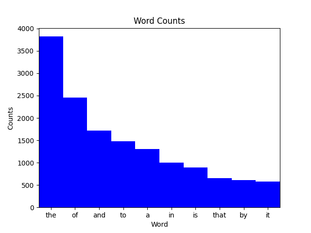

# 들어가며 {#make-automation}

소장하고 있는 책 중 지프의 법칙이 맞는지 관심이 있다고 가정해보자.

::: {#make-zipf .rmdcaution}

가장 자주 출현하는 단어는 두번째 가장 자주 출현하는 단어보다 거의 두배 나타난다.
이를 [지프의 법칙](https://ko.wikipedia.org/wiki/지프의_법칙), 
[Zipf's Law](http://en.wikipedia.org/wiki/Zipf%27s_law)이라고 부른다.

:::

원데이터(책과 파이썬 스크립트)는 준비를 마쳤고 `head books/isles.txt` 명령어로 
소장하고 있는 책중 하나를 빠르게 살펴보자.
작업할 파이썬 스크립트와 데이터 파일은 다음과 같은 구조를 갖고 있다.

```
|- books
|  |- abyss.txt
|  |- isles.txt
|  |- last.txt
|  |- LICENSE_TEXTS.md
|  |- sierra.txt
|- plotcounts.py
|- countwords.py
|- testzipf.py
```

텍스트 파일을 읽어 들이고,
텍스트에 단어갯수를 세고, 출력을 데이터 파일에 저장하는 
`countwords.py` 스크립트로 작성이 되어 있어 먼저 책의 단어 빈도수를 살펴보자.

```
$ python countwords.py books/isles.txt isles.dat
```

`head` 명령어를 사용해서 데이터 파일 첫 5행을 살펴본다면,

```
$ head -5 isles.dat
```

`isles.dat` 파일이 단어마다 한줄씩 구성된 것을 볼 수 있다.

```
the 3822 6.7371760973
of 2460 4.33632998414
and 1723 3.03719372466
to 1479 2.60708619778
a 1308 2.30565838181
```

각 행은, 단어 자체, 해당 단어 출현횟수, 출현횟수를 텍스트 파일에 전체 단어 갯수에 대한 
백분율로 나타낸다. 또다른 예제로:

```
$ python countwords.py books/abyss.txt abyss.dat
$ head -5 abyss.dat
```

```
the 4044 6.35449402891
and 2807 4.41074795726
of 1907 2.99654305468
a 1594 2.50471401634
to 1515 2.38057825267
```

결과를 시각화하자.
`plotcounts.py` 스크립트는 데이터 파일을 읽어들여, 가장 자주 출현하는 10 단어를 도식화한다:

```
$ python plotcounts.py isles.dat ascii

the   ########################################################################
of    ##############################################
and   ################################
to    ############################
a     #########################
in    ###################
is    #################
that  ############
by    ###########
it    ###########
```

`plotcounts.py` 아스키가 아닌 그래프로 결과를 볼 수도 있다.

```
$ python plotcounts.py isles.dat show
```

{width=100%}

윈도우를 닫아 그래프를 빠져나온다.

`plotcounts.py`로 그래프를 이미지(예, PNG 파일)로 저장할 수도 있다:

```
$ python plotcounts.py isles.dat isles.png
```

마지막으로 지프의 법칙을 앞서 분석한 책에 대해 실행해보자.

```
$ python testzipf.py abyss.dat isles.dat

Book	First	Second	Ratio
abyss	4044	2807	1.44
isles	3822	2460	1.55
```

상기 스크립트를 합하면, 작업흐름은 다음을 구현한 것이 된다:

1. 데이터 파일을 읽어들인다.
2. 해당 데이터 파일에 분석을 실시한다.
3. 분석 결과를 신규 파일에 저장한다.
4. 분석 결과에 대한 그래프를 그려 도식화한다.
5. 이미지 파일로 그래프를 저장해서, 논문에 삽입할 수 있게 된다.
6. 분석요약표를 제작한다.

지금까지 작업을 수행한 것처럼, 
쉘 프롬프트에서 `countwords.py` 와 `plotcounts.py` 스크립트를 파일 한둘에 작업하는 것은 문제 없다.
하지만, 텍스트 파일이 5개, 10개, 20개가 된다면, 파이프라인에 작업량이 늘어나게 되면
어마어미한 작업량이 된다. 여기에 더해서 어느 누구도 심지어 30초 가량 소요된다고 
하더라도 앉아서 명령이 종료되기를 원하지 않는다.

지루한 데이터 프로세싱 작업의 가장 일반적인 해법은 시작부터 종료까지
전체 작업과정을 담은 쉘스크립트를 작성하는 것이다.

예를 들어 나노(nano) 같은 텍스트 편집기를 사용해서 `run_pipeline.sh` 파일에 
다음 사항을 추가한다.

```{r shell-run-pipeline, eval = FALSE}
# USAGE: bash run_pipeline.sh
# to produce plots for isles and abyss
# and the summary table for the Zipf's law tests

python countwords.py books/isles.txt isles.dat
python countwords.py books/abyss.txt abyss.dat

python plotcounts.py isles.dat isles.png
python plotcounts.py abyss.dat abyss.png

# Generate summary table
python testzipf.py abyss.dat isles.dat > results.txt
```

쉘 스크립트를 돌려 확인한다. 출력결과는 앞선 결과와 동일하다.

```
$ bash run_pipeline.sh
$ cat results.txt
```

쉘 스크립트를 작성하게 되면 재현성 관련 몇가지 문제를 해결해준다.

1. 명시적으로 파이프라인을 문서화해서 (미래 자신을 포함해서) 동료와
   좀더 효율적으로 커뮤니케이션할 수 있게 돕는다.
2. `bash run_pipeline.sh` 명령어 하나를 타이핑함으로써 전체 분석을 재현할 수 있게 만들었다.
3. 따라서 반복적인 오탈자와 실수를 방지한다. 처음에는 제대로 동작하지 않을 수 있지만,
   버그나 오류를 수정하고 나면 제대로 동작된 상태로 지속된다.


이와 같은 장점에도 불구하고 여전히 몇가지 단점도 존재한다.

`plotcounts.py` 파일로 생성되는 막대그래프 폭을 조정하는 경우를 상정해보자.

`plotcounts.py` 파일을 편집해서 막대 폭을 1.0 대신 0.8로 조정하다.
`plot_word_counts` 함수 정의를 찾아 `width = 1.0` 을 `width = 0.8`으로 바꾼다.

이제 그래프를 다시 제작할 수 있다. `bash run_pipeline.sh` 스크립트만 다시
실행시키기만 하면 된다. 제대로 동작하기 때문에 큰 문제는 없지만,
단어 빈도수를 계산하는 부분이 실행에 오래 걸린다면 큰 문제가 아닐 수 없다.
단어 빈도수를 계산하는 루틴은 변경된 것이 없다; 따라서, 해당 로직을 다시 돌릴
필요는 없다.

대안으로 수작업으로 빈도수가 계산된 파일만 대상으로 그래프를 따로 제작한다.

```{shell shell-book, eval = FALSE}
for book in abyss isles; do
    python plotcounts.py $book.dat $book.png
done
```

하지만 이런 접근방법은 쉘 스크립트를 도입한 장점이 상당수 훼손되었다.

또다른 일반적인 방식은 `run_pipeline.sh` 스크립트 일부를 주석처리하여 실행되지 
않게 하는 것이다.

```{shell shell-comment, eval = FALSE}
# USAGE: bash run_pipeline.sh
# to produce plots for isles and abyss
# and the summary table for the Zipf's law tests.

# These lines are commented out because they don't need to be rerun.
#python countwords.py books/isles.txt isles.dat
#python countwords.py books/abyss.txt abyss.dat

python plotcounts.py isles.dat isles.png
python plotcounts.py abyss.dat abyss.png

# Generate summary table
# This line is also commented out because it doesn't need to be rerun.
#python testzipf.py abyss.dat isles.dat > results.txt
```

이렇게 작성하고 나서 `bash run_pipeline.sh` 명령어를 사용해서 수정한 쉘 스크립트를 
돌려 원하는 결과를 얻어낸다.

하지만, 쉘 스크립트 일부를 주석처리해서 돌리고 나중에 다시 원복하는 방식은 
번거럽고 데이터 처리 파이프라인이 복잡할 경우 오류가 발생할 개연성을 충분히 담게 된다.


[Make](http://www.gnu.org/software/make/)(GNU Make로도 알려짐)는
빠르고, 자유롭게 사용가능하고, 무료이며, 문서화가 잘된 [빌드 관리자(build manager)](reference.html#build-manager)다.
Make는 1977년 벨 연구소 여름 인턴으로 근무한 Stuart Feldman에 의해 개발되었고,
오늘날까지 널리 사용되고 있다.
Make는 분석을 실행하고, 결과를 도식화하는데 필요한 명령어를 실행한다.
쉘스크립트처럼, 단일 쉘 명령어를 통해, 복잡한 순서 명령어를 실행할 수 있다.
쉘스크립트와 달리, 명시적으로 파일 사이에 존재하는 의존성을 기록해서,
텍스트 파일이 변경될 때, 데이터 파일 혹은 이미지 파일을 언제 다시 재생성할지 결정할 수 있다.
새로운 파일을 생성하는데, 파일을 처리하는 일반적인 패턴을 따르는 어떤 명령어에도 Make를 사용할 수 있다. 
예를 들어:

* 원데이터 파일에 분석 스크립트를 실행해서, 원 데이터를 요약하는 데이터를 생성한다.
* 상기 데이터에 시각화 스크립트를 실행해서, 그래프를 생성한다.
* 텍스트와 그래프를 파싱하고 조합해서 논문을 생성한다.
* 소스코드를 컴파일해서 실행 프로그램 혹은 라이브러리를 생성한다.

시중에 이용가능한 빌드 도구가 많이 있다.
예를 들어, [Apache ANT](http://ant.apache.org/), [doit](http://pydoit.org/), 
윈도우용 [nmake](https://msdn.microsoft.com/en-us/library/dd9y37ha.aspx)가 있다.
이런 빌드 도구를 사용하는 스크립트를 빌드하는 빌드 도구도 있다. 
예를 들어, [GNU Autoconf](http://www.gnu.org/software/autoconf/autoconf.html)와
[CMake](http://www.cmake.org/)가 있다.
어떤 도구가 최선인지는 요구사항, 사용 의도, 운영체제에 달려있다.
하지만, 거의 모든 빌드 도구는 Make와 동일한 기본 개념을 공유하고 있다.

::: {#make-old .rmdcaution}

**거의 40살이 된 Make를 왜 사용할까?**

오늘날, 고성능 컴퓨팅에 매우 일반적인 언어인 
C 혹은 포트란 레거시 코드를 갖고 작업한 연구원은 아마도 Make를 접해봤을 것 같다.

재현가능한 연구 작업흐름을 구현하거나, 
(R 혹은 파이썬을 사용해서) 자료분석과 시각화 작업을 자동화하거나,
텍스트를 가지고 표와 그래프를 조합해서 데출판을 위한 보고서와 논문을 작업하는데,
Make를 사용했을 것이다. 

Make의 기본적인 개념은 거의 모든 빌드도구에 공통이다.

:::

[GNU Make](http://www.gnu.org/software/make/)는
빠르고, 자유롭게 사용가능하고, 무료이며, 문서화가 잘 정비되어 있고,
매우 인기가 있고, Make 를 구현한 것 중 하나를 매우 잘 확장하고 있다.
이제부터, GNU Make에 집중한다. 따라서, 
Make를 언급하면, GNU Make를 의미한다.


